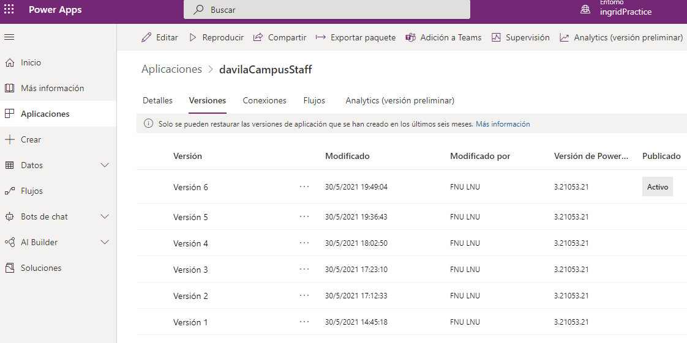
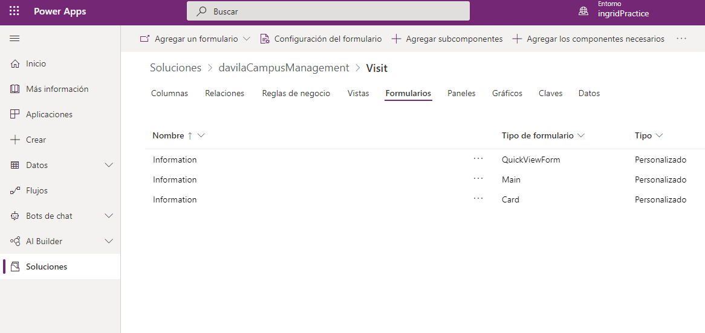
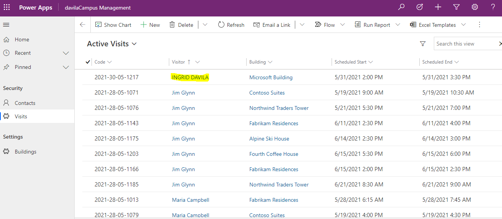
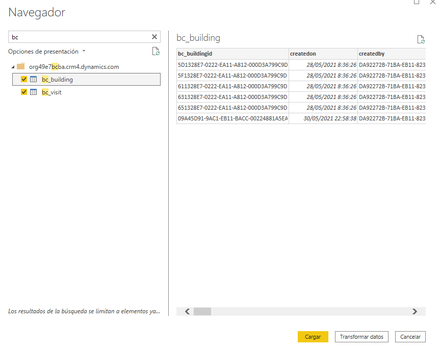
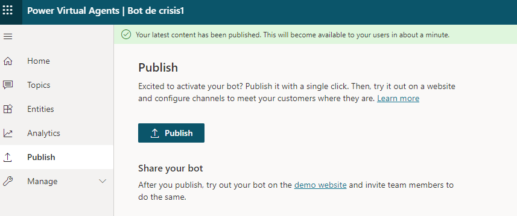

Módulo 0: Introducción al curso
=================================

# Aprovisionar un portal de Power Apps

# Módulo 2: Introducción a Microsoft Dataverse

# Importar datos

# Módulo 3: Comience con Power Apps

# Crear una aplicación de lienzo de seguridad

#   Personalizar vistas y formularios

# Crear la Página web de portal

Nota: Al terner problemas para crear el provisionamiento del portal en el entorno de pruebas. Lo cree en el entorno principal. Y agregué en la tabla de contactos unos datos, para poder reallizar el ejercicio del Portal.

# Módulo 4: Comenzar con Power Automate

# Crear un flujo de notificación de visita

# Crear un flujo de barrido de seguridad

# Módulo 5: Comience con Power BI

## Instalar Power BI Desktop/Preparar el servicio Power BI

## Tarea 2: Preparar los datos

## Crear gráficos y visualizaciones de tiempo

# Crear un panel de control de Power BI

# Agregar visualizaciones con lenguaje natural

# Crear una vista de teléfono móvil y compartir un informe con un código QR

# Módulo 6: Introducción a Power Virtual Agents

## Registrarse en PVA y crear un nuevo bot

# Crear temas

# Probar los temas

# Cambiar el saludo

# Publicar el bot

