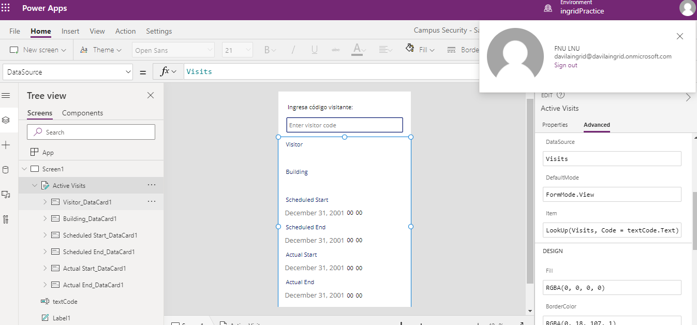

Módulo 0: Introducción al curso
=================================

## Laboratorio: Validar un entorno de laboratorio

## Ejercicio 1: Configuración

### Tarea 1: Adquirir el inquilino de prueba de Power Platform

### Tarea 2: Crear un entorno

# Ejercicio 2: Aprovisionar un portal de Power Apps

# Módulo 2: Introducción a Microsoft Dataverse

## Laboratorio: Modelado de datos

## Tarea 1: Agregar una tabla existente

## Tarea 2: Crear la tabla Edificio

## Tarea 3: Crear la tabla Visita con columnas

# Ejercicio 3: Crear Relaciones

# Ejercicio 4: Importar datos

## Tarea 1: Importar una solución

## Tarea 2: Importar datos  

## Tarea 3: Comprobar la importación de datos

# Módulo 3: Comience con Power Apps

## Laboratorio: Cómo crear una aplicación de lienzo, parte 1

# Módulo 3: Comience con Power Apps

## Laboratorio 2: Cómo crear una aplicación de lienzo,parte2

### 

