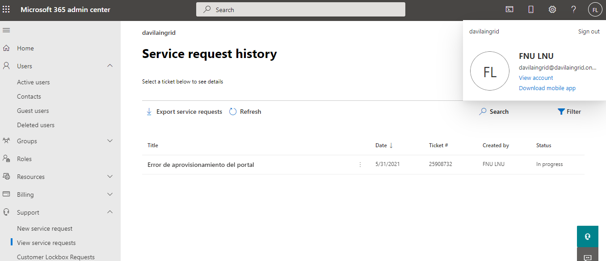
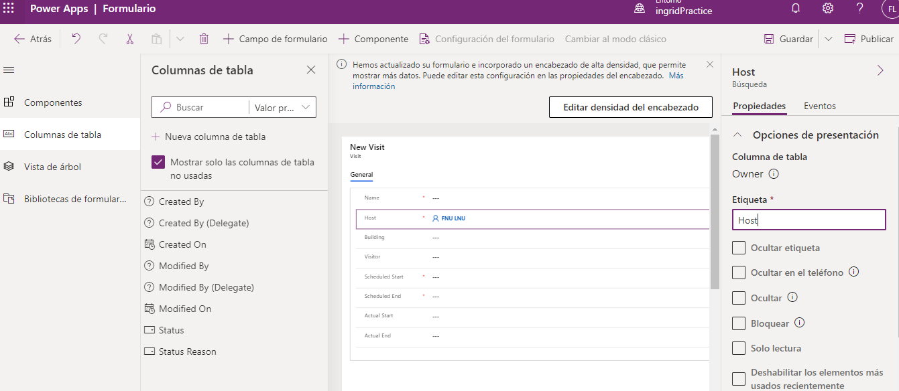
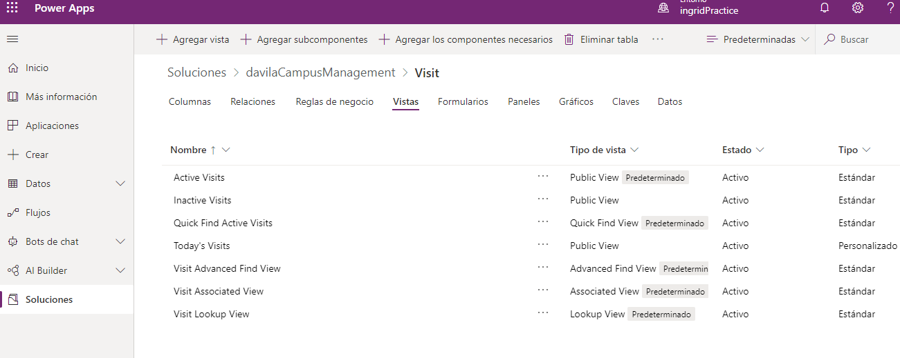
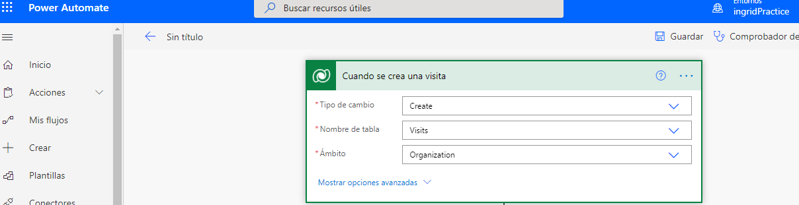
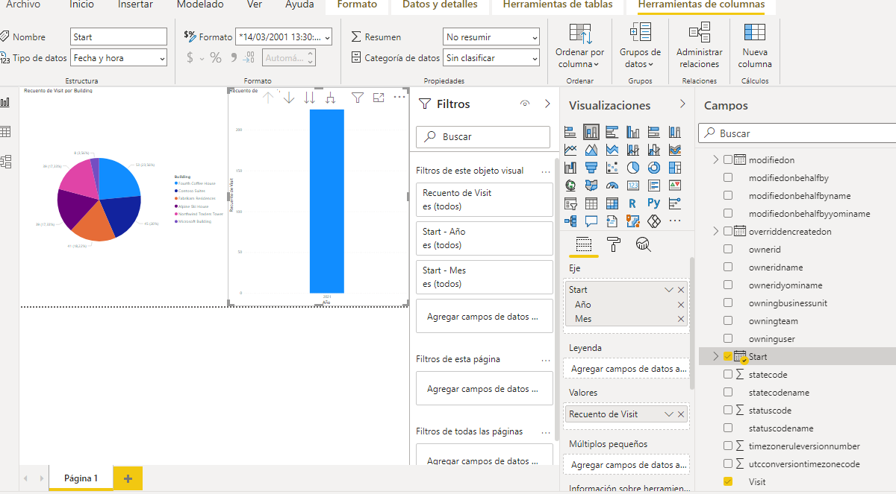

Módulo 0: Introducción al curso
=================================

# Módulo 2: Introducción a Microsoft Dataverse

##  

# Módulo 3: Comience con Power Apps

# Módulo 4: Comenzar con Power Automate

# Módulo 5: Comience con Power BI

